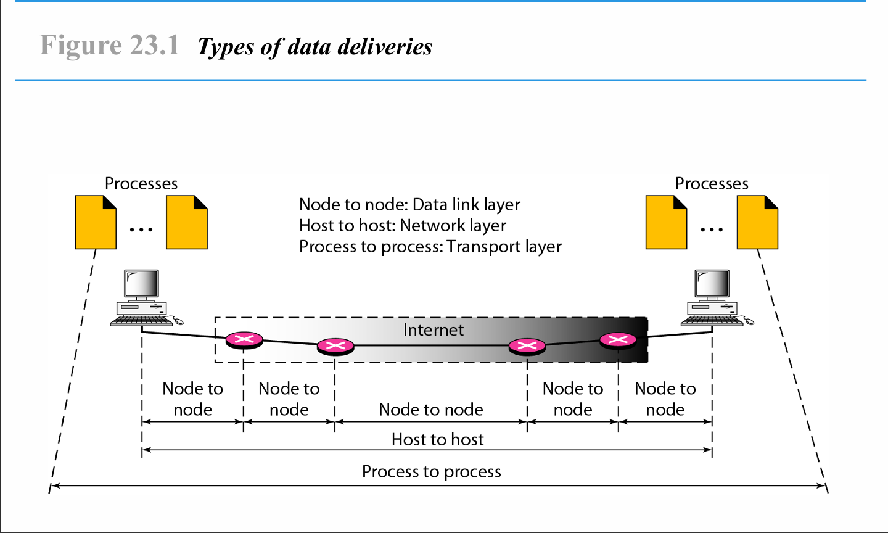

  <h1 style="text-align: center;font-weight: bold">Laporan Resmi Workshop Administrasi Jaringan</h1>
  <h4 style="text-align: center;">Dosen Pengampu : Dr. Ferry Astika Saputra, S.T., M.Sc.</h4>

 

  
  <h3 style="text-align: center;">Disusun Oleh : </h3>
  

    <strong>Hazel Mangadaralam Pratama Rayes (3123500024)</strong> 
  

<h3 style="text-align: center;line-height: 1.5">Politeknik Elektronika Negeri Surabaya Departemen Teknik Informatika Dan Komputer Program Studi Teknik Informatika 2024/2025</h3>
  

# Analisis File http.cap dengan Wireshark

## 1. Versi HTTP yang Digunakan

- Berdasarkan kolom **Info**, terlihat bahwa permintaan **GET /download.html** menggunakan **HTTP/1.1**.
- Respon server juga menggunakan **HTTP/1.1 200 OK**.
- Jadi, versi HTTP yang digunakan dalam komunikasi ini adalah **HTTP/1.1**.
  

  
---

## 2. IP Address dari Client dan Server

- **Client IP Address**:
  

  
  IP Address Client: 145.254.160.237 →  alamat sumber (Source) yang mengirim permintaan HTTP
  
  IP Address Server: 65.208.228.223 → alamat tujuan (Destination) yang menerima permintaan HTTP

---

## 3. Dari gambar Wireshark:

Waktu Client Mengirim Request: 0.9113 detik (Paket No. 4).

Waktu Server Utama Merespons: 4.8469 detik (Paket No. 38).

Total Durasi: 4.8469 - 0.9113 = 3.9356 detik.

**Kesimpulan: Respons dari server utama butuh sekitar 3.94 detik**

# Rangkuman Tahapan Komunikasi Menggunakan TCP

## 1. **Pengertian**

Transmission Control Protocol (TCP) adalah protokol transport yang memastikan komunikasi data antara dua perangkat berlangsung secara andal dan berurutan. TCP bekerja dengan membangun koneksi sebelum data dikirim dan memastikan data sampai dengan benar.
  

  

---

## 2. **Tahapan Komunikasi TCP**

TCP menggunakan **model tiga lapisan komunikasi**, yaitu:

- **Node to Node** (Data Link Layer)
- **Host to Host** (Network Layer)
- **Process to Process** (Transport Layer)

Proses komunikasi TCP terdiri dari beberapa tahapan utama:

### **1. Establishing Connection (Three-Way Handshake)**

Sebelum data dikirim, TCP harus membangun koneksi antara pengirim dan penerima melalui **three-way handshake**:

1. **SYN (Synchronize)**: Klien mengirimkan paket SYN ke server untuk memulai koneksi.
2. **SYN-ACK (Synchronize-Acknowledge)**: Server merespons dengan paket SYN-ACK untuk menyetujui koneksi.
3. **ACK (Acknowledge)**: Klien mengirimkan paket ACK sebagai konfirmasi akhir.

Setelah tahap ini selesai, koneksi TCP dianggap terbuka dan siap untuk komunikasi.

---

### **2. Data Transfer**

Setelah koneksi terbentuk, data dikirimkan dengan mekanisme berikut:

- **Segmentasi**: Data dibagi menjadi beberapa segmen.
- **Penomoran Urutan (Sequence Numbering)**: Setiap segmen diberi nomor urut untuk memastikan pengiriman berurutan.
- **Pengakuan (Acknowledgment)**: Setiap segmen yang diterima dengan benar akan dikonfirmasi oleh penerima.
- **Kendali Kemacetan (Congestion Control)**: TCP mengatur jumlah data yang dikirim untuk menghindari kemacetan jaringan.

---

### **3. Connection Termination (Four-Way Handshake)**

Untuk mengakhiri koneksi, TCP menggunakan proses **four-way handshake**:

1. **FIN**: Klien mengirimkan permintaan untuk menutup koneksi.
2. **ACK**: Server mengakui permintaan dan menunggu proses selesai.
3. **FIN**: Server mengirimkan permintaan untuk menutup koneksi.
4. **ACK**: Klien mengakui permintaan dan koneksi ditutup.

---

## 3. **Kesimpulan**

- TCP menjamin komunikasi yang **andalan, berurutan, dan bebas duplikasi**.
- Terdapat tiga tahap utama: **Establishing Connection, Data Transfer, dan Connection Termination**.
- Protokol ini sangat penting dalam layanan seperti **HTTP, FTP, dan Email**.

Gambar di atas menunjukkan bagaimana data dikirimkan dari proses ke proses melalui berbagai lapisan jaringan, mengikuti prinsip TCP.