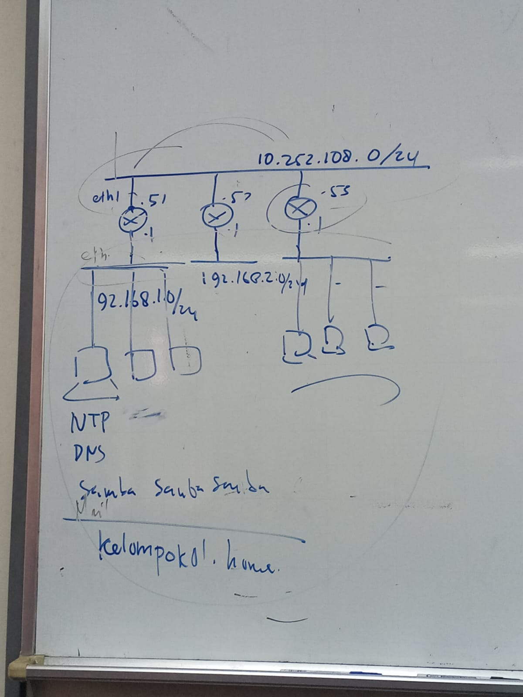
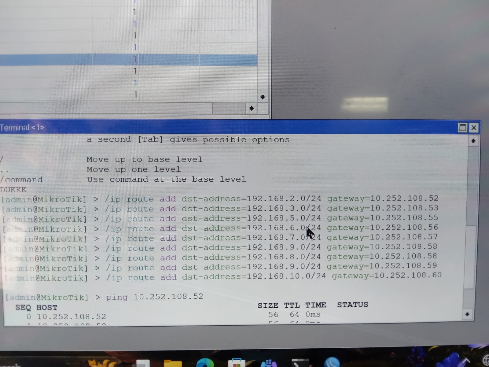
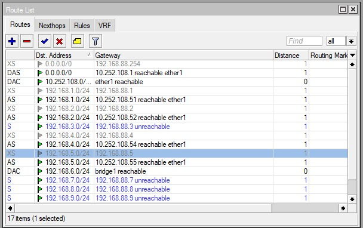
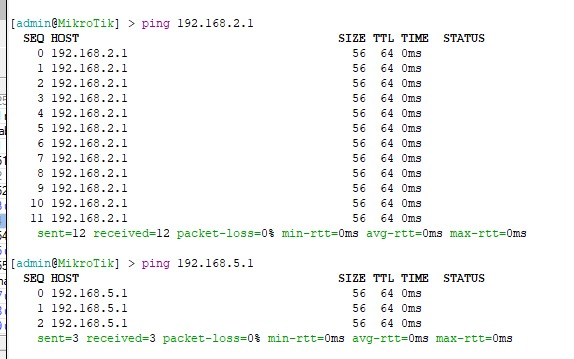
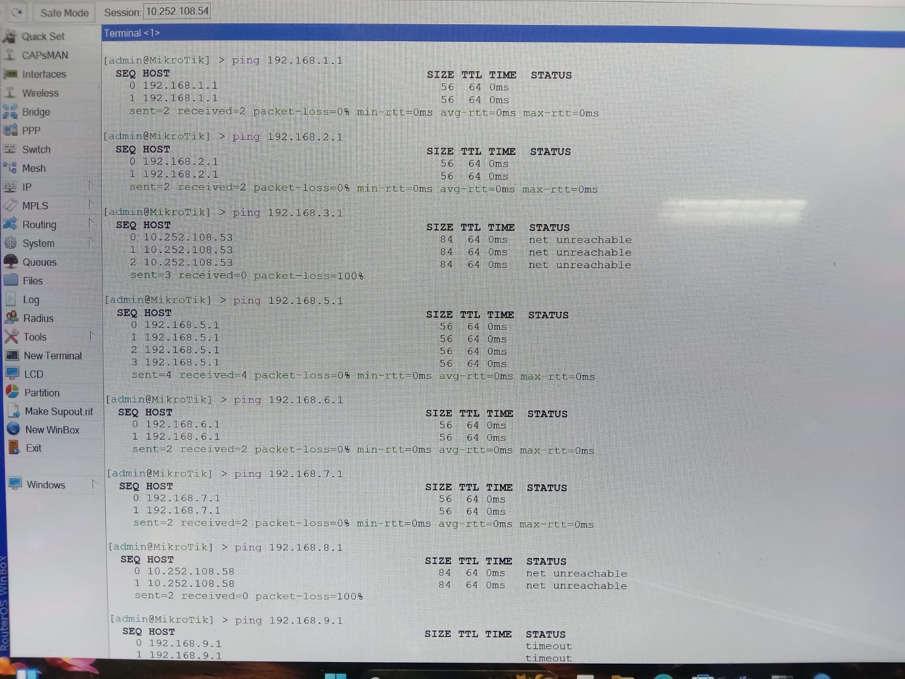

<div align="center">
  <h1 style="text-align: center;font-weight: bold">Laporan Praktikum
  <br>Workshop Administrasi Jaringan</h1>
  <h4 style="text-align: center;">Dosen Pengampu : Dr. Ferry Astika Saputra, S.T., M.Sc.</h4>
</div>
<br />
<div align="center">
  
  <h3 style="text-align: center;">Disusun Oleh : </h3>
  <p style="text-align: center;">
    <strong>Nama: Hazel Mangadaralam Pratama Rayes</strong><br>
    <strong>NRP: 3123500024 </strong><br>
    <strong>Kelas: D3 IT A</strong>
  </p>
<h3 style="text-align: center;line-height: 1.5">Politeknik Elektronika Negeri Surabaya<br>Departemen Teknik Informatika Dan Komputer<br>Program Studi Teknik Informatika<br>2023/2024</h3>
  <hr><hr>
</div>



## Requirements

Untuk praktikum kali ini memerlukan untuk instalasi WinBox untuk melakukan pengujian hubungan antar jaringan.

## Layer Network

Percobaan pertama yang perlu dilakukan berdasarkan skema di atas adalah menghubungkan perangkat MikroTik antar kelompok. Tujuannya agar masing-masing laptop yang terhubung ke LAN dapat melakukan ping ke IP kelompok lain.

Untuk melakukan hal tersebut, salah satu laptop dari setiap kelompok harus tersambung ke jaringan LAN dan melakukan pengujian dengan perintah ping.

Dalam percobaan ini, digunakan alamat IP 10.252.108.5x, di mana x merupakan nomor kelompok. Karena kelompok saya adalah kelompok 4, maka IP MikroTik yang terhubung ke kelompok saya adalah 10.252.108.54.

Setelah perangkat terhubung ke jaringan LAN melalui kabel, saya langsung dapat melakukan ping ke IP lainnya menggunakan Command Prompt di Windows.

## Ping ke device di kelompok lain

Setelah berhasil melakukan ping antar IP MikroTik, tahap selanjutnya adalah memastikan konektivitas antar perangkat dalam jaringan MikroTik. Laptop yang terhubung ke LAN akan secara otomatis mendapatkan alamat IP dengan format 192.168.x.0/24, di mana x merupakan nomor kelompok. Pada kasus saya, alamat yang digunakan adalah 192.168.4.0/24.

Tujuan dari tahap kedua ini adalah agar laptop dapat melakukan ping ke alamat IP dari komputer di jaringan MikroTik kelompok lain, seperti 192.168.1.0, 192.168.2.0, 192.168.3.0, dan seterusnya.

### 1. Menambahkan IP device pada kelompok lain beserta IP gateaway-nya

Langkah pertama adalah menambahkan alamat IP untuk perangkat dari kelompok lain beserta alamat gateway-nya, di mana gateway tersebut adalah MikroTik yang bersangkutan.

Dengan menggunakan WinBox, buka terminal baru dan jalankan perintah berikut untuk menambahkan IP secara statis.

```bash
/ip route add dst-address=192.168.x.0/24 gateaway=10.252.108.5x
```

dimana x adalah nomer kelompok, dst-address adalah destination address dan gateaway adalah IP dari MikroTik-nya.



Jika sudah ditambahkan semua seperti di atas, maka bisa di cek menggunakan Route List di WinBox dan seharusnya akan muncul seperti ini



### 2. Test ping ke device kelompok lain

Setelah tahap pertama sudah selesai, maka bisa lakukan test ping seperti di bawah ini





Jika test ping seperti di atas sudah berhasil, dan status dari setiap test ping kosong, maka koneksi antar device beda kelompok sudah berhasil dilakukan.